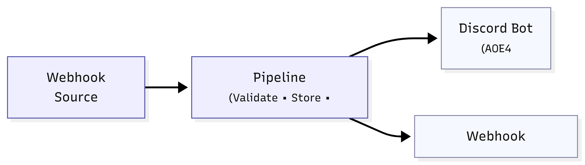
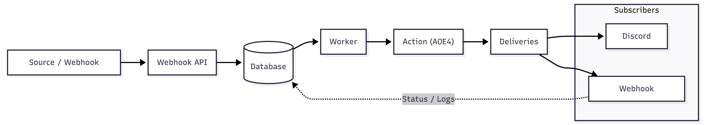

# Webhook-Driven Task Processing Pipeline

A production-style backend system that ingests webhooks, processes them asynchronously, and delivers results reliably to subscribers with retry logic, observability, and security.

---

## Tech Stack

| Category         | Technology              |
| ---------------- | ----------------------- |
| Runtime          | Node.js                 |
| Language         | TypeScript              |
| Framework        | Express.js              |
| Database         | PostgreSQL              |
| ORM              | Drizzle ORM             |
| Validation       | Zod                     |
| Security         | (bcrypt, HMAC)          |
| Containerization | Docker + Docker Compose |
| CI/CD            | GitHub Actions          |

---

## System Overview

This system allows users to create **pipelines** that connect:

- A webhook source
- A processing action
- One or more subscribers

Incoming requests are:

- validated
- stored
- processed asynchronously
- delivered with retry guarantees

---

## Pipelines


Each pipeline defines:

- `sourcePath` → unique webhook URL
- `actionType` → processing logic
- subscribers → delivery targets

---

## Processing Lifecycle

> 

Webhook requests are ingested, validated, stored as events, processed asynchronously by a worker, and their results are delivered to subscribers with retry and status tracking.

## Key Strengths

- Clean separation between API and worker
- Reliable retry logic (jobs + deliveries)
- Replay system for recovery
- Secure webhook verification
- Rate limiting to prevent abuse

---

## Processing Actions

The system implements **3 Specific actions Related to an External API**:

### AOE4 API :

AOE4 ( age of empires 4 is a strategy video games that mostly 2 players or more play in a map with different or similar civillizations each one build his own civ buildings and army with strategy you can use a plan to beat your enemy, your purpose is to destroy the enemy civ)

I used AOE4 external API to fetch data from the game database and used it in my app for 3 type of actions.

### 1. Match Summary

- Fetches match data from AOE4 API
- Extracts winner, duration, map
- Produces readable summary

### 2. Player Profile

- Retrieves player stats
- Computes win rate
- Returns ranking insights

### 3. Map Meta

- Determines best civilization for a map
- Uses aggregated stats
- Provides gameplay recommendation

---

## Replay System

- Endpoint: `POST /jobs/:id/replay`
- Creates a new job from existing event
- Useful for:
  - fixing failed jobs
  - reprocessing after API recovery
  - debugging pipelines

---

## Reliability & Fault Tolerance

### Failure Scenarios & Handling

| Scenario             | System Behavior                                        |
| -------------------- | ------------------------------------------------------ |
| Missing signature    | Request rejected with 401 (early return in controller) |
| Invalid signature    | Request rejected with 403                              |
| External API failure | Job marked pending and retried                         |
| Subscriber failure   | Delivery retried with backoff                          |
| Max retries reached  | Delivery marked as `dead`                              |
| Worker crash         | Jobs remain `pending` and reprocessed                  |

---

### Retry Strategy for jobs + deliveries

- Max attempts: 3
- Exponential backoff for deliveries
- Deliveries use `nextRetryAt`

---

### Dead State

If delivery fails after max retries:

```text
status = "dead"
```

This ensures:

- no infinite retries
- clear failure tracking

---

## Security

### HMAC Signature

- Uses SHA256
- Prevents spoofed requests

### Rate Limiting

- Per `sourcePath` or IP
- Prevents abuse

---

## Monitoring & Observability

### Metrics Endpoint

```http
GET /metrics
```

Returns:

- totalJobs
- completedJobs
- failedJobs
- successRate
- totalDeliveries
- deadDeliveries

---

### Health Check

```http
GET /health
```

Returns:

- uptime
- server status
- timestamp

---

## Database Schema

> 

### Tables

- pipelines
- webhook_events
- jobs
- deliveries
- subscribers

---

### Indexes

#### Jobs

- `jobs_status_idx`
- `jobs_event_id_idx`

#### Deliveries

- `deliveries_status_retry_idx`
- `deliveries_job_id_idx`

#### Subscribers

- `unique_pipeline_url` (unique constraint)

---

These indexes optimize:

- job polling
- retry scheduling
- lookup performance

---

## Design Decisions & Tradeoffs

### 1. Database as Queue

**Chosen over RabbitMQ**

- Simpler setup
- Fewer dependencies

---

### 2. Polling Worker

- Easy implementation
- Predictable

---

### 3. At-Least-Once Delivery

- Reliable
  : Possible duplicates

---

### 4. In-Memory Rate Limiting

Implemented using a simple in-memory Map.

Advantages:

- Very fast (no DB or external service)
- Easy to implement

Tradeoff:

- Not shared across multiple instances
- Each server has its own limit tracking

---

## Getting Started

### Requirements

- Docker
- Git

---

### Setup

```bash
git clone https://github.com/Omarjabari007/Webhook-Driven-Task-Processing-Pipeline.git
cd Webhook-Driven-Task-Processing-Pipeline
docker compose up --build
```

---

### Configuration

| Variable       | Description       |
| -------------- | ----------------- |
| PORT           | API port          |
| DB_USER        | DB username       |
| DB_PASSWORD    | DB password       |
| DB_NAME        | DB name           |
| DATABASE_URL   | connection string |
| WEBHOOK_SECRET | HMAC secret       |

---

## API Example (Full Flow)

### 1. Create Pipeline

```bash
curl -X POST http://localhost:3000/pipelines \
-H "Content-Type: application/json" \
-d '{
  "name": "Meta",
  "sourcePath": "aoe4-meta",
  "actionType": "aoe4_meta"
}'
```

---

### 2. Add Subscriber

```bash
curl -X POST http://localhost:3000/pipelines/<id>/subscribers \
-H "Content-Type: application/json" \
-d '{
  "url": "https://discord.com/api/webhooks/..."
}'
```

Supports **Discord webhook integration**
by formatting payload as:

{
"content": "<message>"
}

---

### 3. Generate Signature

```bash
npm install
npm run sign "{\"map\":\"Rocky River\"}"
```

---

### 4. Send Webhook

```bash
curl -X POST http://localhost:3000/webhooks/aoe4-meta \
-H "Content-Type: application/json" \
-H "x-signature: <signature>" \
-d '{"map":"Rocky River"}'
```

---

### 5. Check subscriber

## Project Structure

```text
src/
├── app.ts
│
├── db/
│   ├── index.ts
│   └── schema/
│       ├── pipelines.ts
│       ├── subscribers.ts
│       ├── webhookEvents.ts
│       ├── jobs.ts
│       ├── deliveries.ts
│       ├── statusEnum.ts
│       └── index.ts
│
├── modules/
│   ├── pipelines/
│   │   ├── pipelines.controller.ts
│   │   ├── pipelines.service.ts
│   │   ├── pipelines.routes.ts
│   │   ├── pipelines.schema.ts
│   │   └── pipelines.types.ts
│   │
│   ├── subscribers/
│   │   ├── subscribers.controller.ts
│   │   ├── subscribers.service.ts
│   │   ├── subscribers.routes.ts
│   │   ├── subscribers.schema.ts
│   │   └── subscribers.type.ts
│   │
│   ├── webhooks/
│   │   ├── webhooks.controller.ts
│   │   ├── webhooks.service.ts
│   │   ├── webhooks.routes.ts
│   │   └── webhooks.schema.ts
│   │
│   ├── jobs/
│   │   ├── jobs.controller.ts
│   │   ├── jobs.service.ts
│   │   ├── jobs.routes.ts
│   │   └── jobs.schema.ts
│   │
│   ├── workers/
│   │   ├── worker.ts
│   │   ├── jobs.processor.ts
│   │   ├── deliveries.processor.ts
│   │   └── types.ts
│   │
│   ├── actions/
│   │   ├── aoe4.action.ts
│   │   ├── aoe4_player_profile.ts
│   │   ├── aoe4-meta.action.ts
│   │   └── index.ts
│   │
│   └── metrics/
│       ├── metrics.controller.ts
│       ├── metrics.service.ts
│       └── metrics.routes.ts
│
├── middlewares/
│   ├── error.middleware.ts
│   ├── validate.middleware.ts
│   └── rateLimit.middleware.ts
│
├── mappers/
│   └── pipeline.mapper.ts
│
├── utils/
│   ├── AppError.ts
│   ├── asyncHandler.ts
│   ├── backoff.ts
│   ├── signature.ts
│   ├── logger.ts
│   └── format.ts
---

## Requirements Fulfilled

| Requirement          | Status |
| -------------------- | ------ |
| CRUD pipelines       | ✅     |
| Webhook ingestion    | ✅     |
| Background worker    | ✅     |
| 3 processing actions | ✅     |
| Retry logic          | ✅     |
| Job tracking API     | ✅     |
| Docker setup         | ✅     |
| CI/CD pipeline       | ✅     |
| Documentation        | ✅     |

---

## Evaluation Criteria Coverage

| Area           | Implementation              |
| -------------- | --------------------------- |
| Architecture   | Modular + worker separation |
| Reliability    | Retry + dead state          |
| Code Quality   | TypeScript + Zod            |
| Infrastructure | Docker + CI                 |
| Documentation  | This README                 |
| Creativity     | AOE4 integrations           |

---

## Stretch Goals Implemented

- Rate limiting
- Signature verification
- Metrics endpoint
- Replay system
- Discord integration

---

## Future Enhancements

- Logging system (structured logs)
- Pipeline chaining
- Dashboard UI
- Distributed queue (Redis/RabbitMQ)
- Dead-letter queue

---
```
